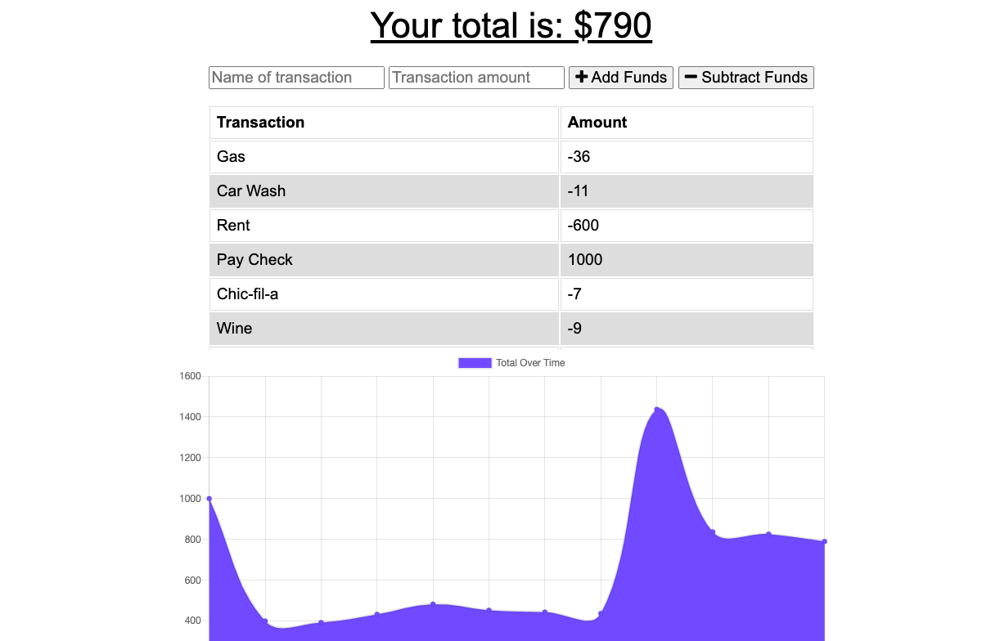

# Budget Tracker

## About
An app that allows users to track their finances on or offline by adding and subtracting money from their budget for every transaction made.  Created using JavaScript, Node, Express, IndexedDB, MongoDB, and Mongoose.

## Screenshot

## Link to Deployed Site
https://mybudget-tracker-app.herokuapp.com/
